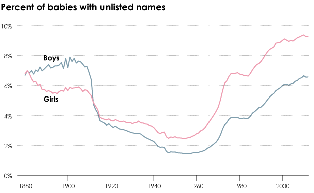

> Another intriguing way to document the cultural shift toward individualism is in the names parents give their children. When parents want their children to fit in, as they do in a collectivistic culture, they are more likely to give them common names that many other people also have. When parents instead want their children to stand out, as they do in an individualistic culture, they are less likely to bestow common names because individualism values uniqueness.
> 
> <cite>Jean M. Twenge, [Generations](https://www.amazon.com/Generations-Differences-Millennials-Silents_and-Americas/dp/1982181613)</cite>

This is one of the best books I've read in the last decade. It's not about baby names, but every time a parent has told me their new baby's name (or told me they're not sharing yet — a whole separate phenomenon worthy of attention) I can't help but think about this quote from Generations.

What separates someone who names their child "Michael" (something common), for example, from someone who names their child "Anden" (something unique)? Jean M. Twenge suggests the answer is **culture**. To whatever degree this is true (and full disclosure, it sure seems to explain a lot to me) I'm really fascinated with how it's possible for people, presumably from the same culture, to end up on different sides of this.

[Flowing Data highlighted](https://flowingdata.com/2013/07/29/the-most-trendy-names-in-us-history/) the changes in name diversity over the years using name data from the Social Security Administration the upward trend in babies who have names that don't yet exist in the database is trending strongly upwards.

---

If you're fascinated by this too, you might find these links interesting.
- [Flowing Data](https://flowingdata.com/): one of my favorite websites. Period.
- [NameGrapher](https://namerology.com/baby-name-grapher/): Explore the historical popularity of United States baby names
- [The epic rise and fall of the name Heather](https://qz.com/1390135/the-epic-rise-and-fall-of-the-name-heather): Nothing against Heathers, but this is fascinating.
